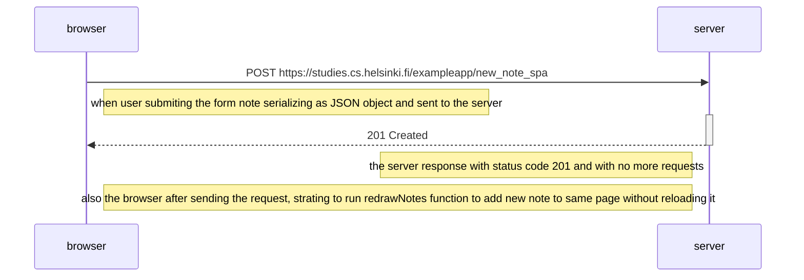

```mermaid
sequenceDiagram

    participant browser
    participant server

    
     browser->>server: POST https://studies.cs.helsinki.fi/exampleapp/new_note_spa
     Note right of browser: when user submiting the form note serializing as JSON object and sent to the server
    activate server
    server-->>browser: 201 Created
    deactivate server

    Note left of server: the server response with status code 201 and with no more requests

    Note right of browser: also the browser after sending the request, strating to run redrawNotes function to add new note to same page without reloading it
    

```